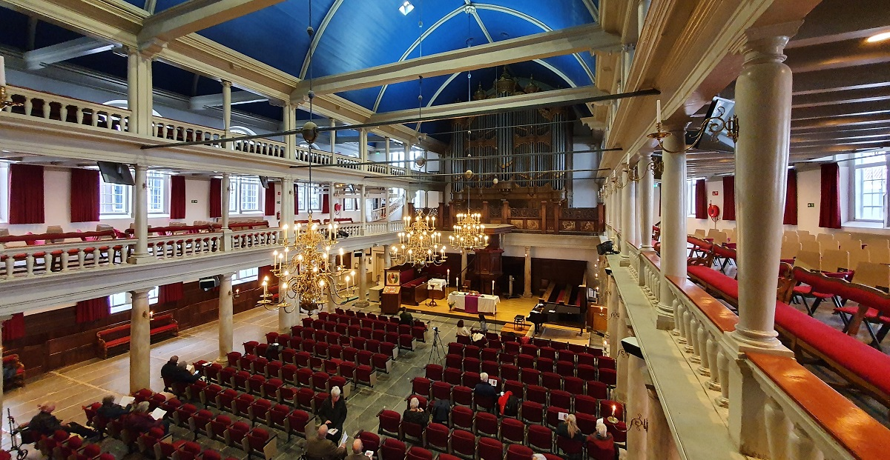

```{css, echo=FALSE}

.break .nav-tabs, .break .nav-pills {
  display: flex;
  justify-content: center;
  width: 100%;
}

.break .nav-tabs .nav-item, .break .nav-pills .nav-item {
  margin: 0 auto; /* Centers the nav items if they have a specific width */
}

.break .nav-tabs .nav-link, .break .nav-pills .nav-link {
  margin-right: 5px; /* Optional: Adds some space between the tabs */
}


.button {
  background-color: #144F7C; /* Blue background */
  border: none;
  color: white;
  padding: 10px 20px; /* Size of the padding around the text */
  text-align: center;
  text-decoration: none;
  display: inline-block;
  font-size: 16px; /* Size of the font */
  margin: 4px 2px;
  cursor: pointer;
  border-radius: 5px; /* Rounded corners */
  transition-duration: 0.4s; /* Smooth transition effect for hover state */
}

/* Darker background on mouse-over */
button:hover {
  background-color: #17616A;
}


a {
  color: #1e6bb8;
  text-decoration: none;
}
a:hover {
  text-decoration: underline;
}


.break .nav-tabs, .break .nav-pills {
  display: flex;
  justify-content: center;
  width: 100%;
}

.break .nav-tabs .nav-item, .break .nav-pills .nav-item {
  margin: 10 auto; /* Centers the nav items if they have a specific width */
}

.break .nav-tabs .nav-link, .break .nav-pills .nav-link {
  margin-right: 5px; /* Optional: Adds some space between the tabs */
  font-size: 16px; /* Size of the font */
}

blockquote {
  border-left: none; /* Removes the left border or bar */
  color: #159957; /* Sets the text color to black */
  margin-left: 0; /* Adjusts the left margin if necessary */
  padding-left: 0; /* Removes padding on the left if it exists */
}

.title {
    display: none;
}
```

<!-- <style> -->
<!-- img { -->
<!--   height: 356px; -->
<!--   width: 356px; -->
<!--   border-radius: 0.3rem; -->
<!--   object-fit: cover; -->
<!-- } -->

<!-- Custom Header Start -->
<div class="header">
  <h2 class="project-name">Mads's Doctoral Defense Ceremony</h2>
  <h3 class="project-tagline">Find all the information below for Mads's big day! ✨🚤👨🏻‍🎓✨</h3>
</div>
<!-- Custom Header End -->

<center>


You are cordially invited to attend when Mads will defend his PhD dissertation, entitled:

<p class="fancy2">The Nature and Consequences of Online Political Microtargeting</p>


<center><h4>Please let us know if you plan to attend by clicking the button below</h4></center>

<center><a href="https://forms.gle/f4YLD5jomEYPTgKy7" class="button" style="color: white;">RSVP</a></center>

<h4 class="fancy3">📅 Friday, April 19, 2024</h2>


</center>

<hr>

<h4>Join us and celebrate as our dear Mads becomes...</h4>


```{r, echo = TRUE}
title <- "Dr."
name <- "Mads Fuglsang Hove"
print(glue::glue("{title} {name}"))
```

<hr>

<!-- ***️❗️ Make sure to scroll all the way to the end for the secret page! (unless you're Fabio, in which case, nothing to see here...️)*** -->

## > Event Information {.tabset .tabset-fade .tabset-pills .break #event_info}


<center>

**📅 Date:** Friday, April 19, 2024

*Click [here](https://calendar.google.com/calendar/u/4?cid=ZmFiaW8udm90dGEuZGVmZW5zZUBnbWFpbC5jb20) to download full day calendar invite and location information.*


### 14:00 Defense Ceremony 🧑🏻‍🏫 {#dissertation_info}

**🕐 Time:**
14:00 (2:00PM) - 15:30 (3:30PM)

> *Please arrive 30 minutes before starting time at **13:30** as entry is not allow once the ceremony starts.*


**>📍 Location:** [Aula UvA, Singel 411, 1012 WN Amsterdam](https://www.google.com/maps/place//data=!4m2!3m1!1s0x47c609c193a4380f:0xccfdbd1232ff182d?sa=X&ved=2ahUKEwjXqt7Xy7WEAxUd_7sIHeA-A-4Q4kB6BAgPEAA)

.JPG)

**📝 Program:**

| Time     | Agenda |
| -------- | ------- |
| 13:30  | Arrival and entry    |
| 14:00 | Start of Presentation (Layman's Talk)     |
| 14:10    | End of Presentation    |

*5 MINUTES BREAK*

| Time     | Agenda |
| -------- | ------- |
| 14:15  | Committee Entrance + Q&A session   |
| 15:00 | Committee Decision    |
| 15:30    | End of Defense Ceremony   |

**🎥 Livestream Link:**

Click [here](https://www.uva.nl/en/research/phd/phd-defence-ceremony-agenda/phd-defence-ceremonies.html?t=fmg) to access the livestream.


<details>
  <summary>**> 🚗🚇🚋 How To Get There**
</summary>


Public Transport


🚇 Metro Station **Rokin** via *Metro 52 (Blue Line)*

🚋 Tram Station **Rokin** via *Tram 4*, *Tram 14*, and *Tram 24*

🚋 Tram Station **Koningsplein** via *Tram 2* and *Tram 12*


Car Parking Options:

*Note that finding a parking spot may be difficult*

🅿️ Stopera/Waterlooplein (Valkenburgerstraat 238)

🅿️ Q-Park de Bijenkorf (Beursstraat 15)


</details> 




<!-- <br> -->
<!-- </br> -->

### 15:30 Reception 🍻 {#borrel}
**🕐 Time:**
15:30 (3:30PM) - 17:00 (5:00PM)
  
> *The reception (snacks & drinks) begins directly after the defense ceremony and is at the same location.*


**>📍 Location:** [Aula UvA, Singel 411, 1012 WN Amsterdam](https://www.google.com/maps/place//data=!4m2!3m1!1s0x47c609c193a4380f:0xccfdbd1232ff182d?sa=X&ved=2ahUKEwjXqt7Xy7WEAxUd_7sIHeA-A-4Q4kB6BAgPEAA)


<details>
  <summary>**> 🚗🚇🚋 How To Get There**
</summary>


Public Transport


🚇 Metro Station **Rokin** via *Metro 52 (Blue Line)*

🚋 Tram Station **Rokin** via *Tram 4*, *Tram 14*, and *Tram 24*

🚋 Tram Station **Koningsplein** via *Tram 2* and *Tram 12*


Car Parking Options:

*Note that finding a parking spot may be difficult*

🅿️ Stopera/Waterlooplein (Valkenburgerstraat 238)

🅿️ Q-Park de Bijenkorf (Beursstraat 15)


</details> 


### 19:30 Party 🎉 {#after_party}
**🕐 Time:**
19:30 (7:30PM) - *open end*

<p class="fancy">dr::Mads Fuglsang Hove</p>

> *Let's celebrate Mads's ascension to doctoriety!*


**>📍 Location:** Amstelhaven [Op Professor Tulpplein / naast Amstelhotel, Mauritskade 1, 1091 EW Amsterdam](https://www.google.com/maps/place//data=!4m2!3m1!1s0x47c6099a0deb8719:0x54e805a776cfbeed?sa=X&ved=2ahUKEwiH2NDt57WEAxXog_0HHRkKCa0Q4kB6BAg5EAA)

<br>

<details>
  <summary>**> 🚗🚇🚋 How To Get There**
</summary>


Public Transport


🚇 Metro Station **Wesperplein** via *Metro 51* (Orange Line), *Metro 53* (Red Line), and *Metro 54* (Yellow Line)

🚋 Tram Station **Weesperplein** via *Tram 1*, *Tram 7*, and *Tram 19*


</details> 


<hr>

## 🎁🗺️☀️ Mads's Gifts 🏖️🚤🎁 {.tabset .tabset-fade .tabset-pills .break #gifts}

### 🎁 Main Gift {#main_gift}

<center>
After all these years of hard work, Mads is very much looking forward to spending some time away from the screen on a nice sunny and warm beach; maybe even spend some time on a boat!

</center>

If you would like to contribute, please use the bank transfer information provided below.

**Deadline to contribute:** Wednesday, April 17th, 2024

**IBAN:** NL22 TRIO 0788 8536 94

**Account Holder Name:** Sophie Minihold

**Reference Note:** Defense Mads + Your Name

*If you make your contribution by April 17th, we can still include your name on the card that we will give Mads on his defense day.*

<center>
***❗️ [Don't forget to click on the Secret Gift tab above](https://fabio-defense.phd/FABIO_DO_NOT_OPEN.html)❗***
</center>

### 🤫🎁 Secret Gift {#secret_gift}
<center>
Please click the button below for information on Mads's gift (if you're not Mads)

<center><a href="FABIO_DO_NOT_OPEN.html" class="button" style="color: white;">🤫🎁 Mads's Secret Gift 🎁🤫</a></center>
</br>

</center>

# {-}

<hr>

## 📸 Event Media

<center>

**Instagram:** @fabiodefense

**Hashtag:** #DrMads

<hr>

</center>

</center>


## 📰📝🌎 Mads's Work (in the media & beyond) {.tabset .tabset-fade .tabset-pills .break}

### 📖 Dissertation

<center>
<p class="fancy2">The Nature and Consequences of Online Political Microtargeting</p>
</center>

<center><a href="https://drive.google.com/file/d/1g9bxhvUc5s3hRW7a0RUCnuUf1TH4bvD_/view?usp=sharing" class="button" style="color: white;">Download Dissertation</a></center>


The dissertation explores the practice of *political microtargeting*, a technique where political campaigns use data, often provided by social media, to send tailored messages to specific groups of voters, for example to persuade or mobilize them. It's a widespread practice in today's digital age, impacting how political messages are crafted and delivered globally. 

The dissertation delves into three key aspects: how widespread the practice is globally (Chapter 2), how algorithms influence the delivery of political ads (Chapter 3), and how microtargeting might be used to deliver very negative (or "toxic") messages (Chapter 4).


**Slidedecks**

+ [Algorithmic Microtargeting? How ad delivery algorithms influence distribution of political ads](https://favstats.github.io/algomicro/epsa2023#1)

+ [Who Doesn'(t) Target You? Mapping the Worldwide Usage of Online Political Microtargeting](https://favstats.github.io/ddc2023/#1)


<!-- Chapter 2: Key findings include the varied sophistication of microtargeting practices around the world. In many places, campaigns use basic information like where people live or their age to target them, rather than more complex data. The study also shows that political microtargeting is not just used in democracies but across different types of political systems. Another important finding is how microtargeting is typically used to mobilize existing supporters and those already interested in politics rather than to reach out to new ones. This potentially limits the diversity of political discourse as different voters see political information from parties they are more likely to agree with. -->

<!-- Chapter 3: The dissertation discusses how algorithms decide how ads reach people. These algorithms can create biases, affecting which groups are reached and how much it costs to reach them. The dissertation finds that in the Netherlands this leads to unfair advantages for some political parties making it so that is cheaper for them to target certain audiences (and overall). -->

<!-- Chapter 4: The research finds that microtargeting allows campaigns to discreetly target specific groups with controversial messages in the United States, raising concerns about ethics and transparency. "Toxic" messages, which are likely to backfire are more likely to be targeted at smaller audiences. -->


### 📝 Publications

[Afonso, A., & **Votta, F.** (2022). Electoral and religious correlates of COVID-19 vaccination rates in Dutch municipalities. 'European Journal of Public Health', 32(6), 985-987.](https://academic.oup.com/eurpub/article/32/6/985/6673913)

[Banai, A., **Votta, F.**, & Seitz, R. (2022). The Polls—Trends: Trends in Public Opinion toward Immigration among EU Member States. Public Opinion Quarterly, 86(1), 191-215.](https://academic.oup.com/poq/article/86/1/191/6545793)


[Beraldo, D., Milan, S., de Vos, J., Agosti, C., Sotic, B. N., Vliegenthart, R., ... & **Votta, F.** (2021). Political advertising exposed: tracking Facebook ads in the 2021 Dutch elections. *Internet Policy Review* (Mar. 11, 2021). URL: https://policyreview. info/articles/news/politicaladvertising-exposed-tracking-facebook-ads-2021-dutch-elections/1543.](https://policyreview.info/articles/news/political-advertising-exposed-tracking-facebook-ads-2021-dutch-elections/1543)

[Dobber, T., Kruikemeier, S., **Votta, F.**, Helberger, N., & Goodman, E. P. (2023). The effect of traffic light veracity labels on perceptions of political advertising source and message credibility on social media. *Journal of Information Technology & Politics*, 1-16.](https://www.tandfonline.com/doi/full/10.1080/19331681.2023.2224316)

[Guinaudeau, B., Munger, K., & **Votta, F.** (2022). Fifteen seconds of fame: TikTok and the supply side of social video. Computational Communication Research, 4(2), 463-485.](https://www.aup-online.com/content/journals/10.5117/CCR2022.2.004.GUIN)


[van Drunen, M. Z., Groen-Reijman, E., Dobber, T., Noroozian, A., Leerssen, P. J., Helberger, N., de Vreese, C. H., & **Votta, F.**. (2022). Transparency and (no) more in the Political Advertising Regulation. *Internet Policy Review*.]( https://policyreview.info/articles/news/transparency-and-no-more-political-advertising-regulation/1616)

[Vreese, C. D., & **Votta, F.** (2023). AI and Political Communication. Political Communication Report, 2023.](https://refubium.fu-berlin.de/bitstream/handle/fub188/39328/PCR-23-01_deVreese&Votta.pdf;jsessionid=30AF721FF3B3BE72F1BFE936E42D018E?sequence=1)


[**Votta, F.**, Noroozian, A., Dobber, T., Helberger, N., & de Vreese, C. (2023). Going Micro to Go Negative? Targeting Toxicity using Facebook and Instagram Ads. *Computational Communication Research*, 5(1), 1-50.](https://www.aup-online.com/content/journals/10.5117/CCR2023.1.001.VOTT)

[Whittaker, J. & Looney, S. & Reed, A. & **Votta, F.** (2021). Recommender systems and the amplification of extremist content. Internet Policy Review, 10(2). https://doi.org/10.14763/2021.2.1565](https://policyreview.info/articles/analysis/recommender-systems-and-amplification-extremist-content)


### 📰 Media

A list of media appearances and references in TV, radio and newspapers.

**`r emo::ji("de")` ZDF Magazin Royale (in German)**

  + Political microtargeting during German 2021 election (in colab with Who Targets Me): [YouTube Video](https://www.youtube.com/watch?v=8vq6MzGNZyM)
  + [Data Visualization](https://targetleaks.de/netzwerkdiagramme)

**`r emo::ji("netherlands")` Volkskrant (in Dutch)**

  + [Politieke online advertenties in campagnetijd: wie houdt van André Hazes, is interessant voor BBB](https://www.volkskrant.nl/cultuur-media/politieke-online-advertenties-in-campagnetijd-wie-houdt-van-andre-hazes-is-interessant-voor-bbb~bf90e8dd/)
  + [Caroline van der Plas' victory is also the victory of good old television](https://www.volkskrant.nl/columns-opinie/de-overwinning-van-caroline-van-der-plas-is-ook-de-overwinning-van-die-goeie-ouwe-televisie~b9e496bb/?utm_medium=Social&utm_source=Twitter#Echobox=1679072916)
  
**`r emo::ji("netherlands")` De Groene Amsterdammer (in Dutch)**

  + Research during the 2023 Dutch election: [The Ignored Citizen](https://www.groene.nl/artikel/de-genegeerde-burger)
  + Dashboard for the 2023 Dutch election: [De Campagnemonitor](https://campagnemonitor.groene.nl/)

**`r emo::ji("it")` Quotidiano Nazionale (in Italian)**

  + [I rischi della profilazione elettorale sul web: "Si può usare per manipolare le persone"](https://www.quotidiano.net/politica/elezioni-profilazione-facebook-6f7088f9)
  + [Spot su Facebook e Instagram, i soldi spesi per le Regionali. Medici nel mirino del Pd](https://www.quotidiano.net/politica/elezioni-regionali-spot-66b1de1e)


**`r emo::ji("netherlands")` RTL Nieuws (in Dutch)**

  + [PVV gaf slechts 4500 euro uit aan advertenties, NSC niets](https://www.rtlnieuws.nl/economie/artikel/5421155/advertentie-uitgaven-politieke-partijen-verkiezingen-2023-pvv-nsc)

**`r emo::ji("netherlands")` DutchNews.nl**

  + [Parties less keen on social media in run up to elections: FD](https://www.dutchnews.nl/2023/11/parties-less-keen-on-social-media-in-run-up-to-elections-fd/)
  
  
  
**`r emo::ji("netherlands")` Het Financieele Dagblad (in Dutch)**

  + [Inperking Facebook en Instagram donkere wolk boven verkiezingscampagnes](https://fd.nl/tech-en-innovatie/1494966/inperking-facebook-en-instagram-donkere-wolk-boven-verkiezingscampagnes)
  + [Enthusiasm in online campaigning is crumbling, but not yet for everyone](https://fd.nl/tech-en-innovatie/1494664/enthousiasme-online-campagnevoeren-brokkelt-af-maar-nog-niet-bij-iedereen)
  
**`r emo::ji("belgium")` De Tijd (in Dutch)**

  + [Vlaamse partijen guller dan ooit met Facebook-reclame, ondanks alle kritiek](https://www.tijd.be/politiek-economie/belgie/verkiezingen/vlaamse-partijen-guller-dan-ooit-met-facebook-reclame-ondanks-alle-kritiek/10504905.html)
  

**`r emo::ji("belgium")` Apache (in Dutch)**

  + [Vlaams Belang betaalt 90 keer meer voor 1.000 Facebookgebruikers dan CD&V](https://apache.be/2024/01/18/vlaams-belang-betaalt-90-keer-meer-voor-1000-facebookgebruikers-dan-cdv)
  + [Voor Vlaams Belang liever geen fans van Galatasaray of couscous](https://apache.be/2023/12/15/vlaams-belang-galatasaray-couscous-etnisch-profileren)
  
### 📊📈 Dashboards

Here is a list of dashboards that were created to monitor microtargeting and digital campaigns during election time:


+ `r emo::ji("netherlands")` [2021 Dutch parliamentary election](https://favstats.github.io/DutchElectionObservatory/en/index.html) (15th-17th March 2021)
+ `r emo::ji("de")` [2021 German federal election](https://favstats.shinyapps.io/btw21_wtm) (26 September 2021)
+ `r emo::ji("sweden")` [2022 Swedish general election](https://favstats.github.io/SwedishElection2022/) (11th September 2022)
+ `r emo::ji("us")` [2022 United States midterm elections](https://whotargetsme.shinyapps.io/midterms2022/) (8th November 2022)
+ `r emo::ji("us")` [2022 United States midterm elections - Georgia Runoff](https://whotargetsme.github.io/midterms2022_dashboard/) (6th December 2022)
+ `r emo::ji("it")` [2023 Lazio & Lombardy regional election](https://favstats.github.io/regionali2023/) (12-13th February 2023)
+ `r emo::ji("estonia")` [2023 Estonian parliamentary election](https://favstats.github.io/EstoniaElection2023/) (5th March 2023)
+ `r emo::ji("netherlands")` [2023 Dutch provincial elections](https://favstats.github.io/ProvincialeStatenverkiezingen2023/) (15th March 2023)
+ `r emo::ji("montenegro")` [2023 Montenegrin presidential elections](https://favstats.github.io/MontenegroPresidentialElection2023/) (19th March 2023) - 1st round
+ `r emo::ji("australia")` [2023 New South Wales state election](https://favstats.github.io/NSWAustralianElection2023/) (25th March 2023)
+ `r emo::ji("finland")` [2023 Finnish parliamentary election](https://favstats.github.io/FinlandElections2023/) (2 April 2023)
+ `r emo::ji("tr")` [2023 Turkish general election](https://favstats.github.io/TurkishElection2023/round1) (14 May 2023) - Round 1
+ `r emo::ji("de")` [2023 Bremen State election](https://favstats.github.io/BremenStateElection2023/) (14 May 2023)
+ `r emo::ji("greece")` [2023 Greek Legislative election](https://favstats.github.io/BremenStateElection2023/) (21 May 2023)
+ `r emo::ji("tr")` [2023 Turkish Presidential election](https://favstats.github.io/TurkishElection2023/) (14 May 2023) - Round 2
+ `r emo::ji("montenegro")` [2023 Montenegrin parliamentary elections](https://favstats.github.io/2023MontenegrinParliamentaryElection/) (11 June 2023)
+ `r emo::ji("greece")` [2nd 2023 Greek Legislative election](https://favstats.github.io/2ndGreeceElection2023/) (25 May 2023)
+ `r emo::ji("slovakia")` [2023 Slovak parliamentary election](https://favstats.github.io/slovakia2023/) (30 September 2023)
+ `r emo::ji("germany")` [2023 Bavarian state election](https://favstats.github.io/LTW2023/bavaria) (8 October 2023)
+ `r emo::ji("germany")` [2023 Hessian state election](https://favstats.github.io/LTW2023/hessen) (8 October 2023)
+ 🇳🇿 [2023 New Zealand general election](https://favstats.github.io/NZ2023/) (14 October 2023)
+ `r emo::ji("poland")` [2023 Polish parliamentary election](https://favstats.github.io/poland2023/) (15 October 2023)
+ `r emo::ji("us")` [US Presidential Primaries](https://favstats.github.io/USprimaries2024/) (2023-2024)


### 🏆 Awards


**APSA ITP Best Journal Article Award 2023**

This award is given to best article published in Information Technology and Politics (ITP). The awarded paper is: *Fifteen Seconds of Fame: TikTok and the Supply Side of Social Video.*


**Best Paper Award in Political Communication at ICA 2023**

This award is given to the best paper presented in the Political Communication division at the International Communication Association (ICA) annual conference in Toronto 2023. The awarded paper is: *Algorithmic Microtargeting? Testing the Influence of the Meta Ad Delivery Algorithm.*
